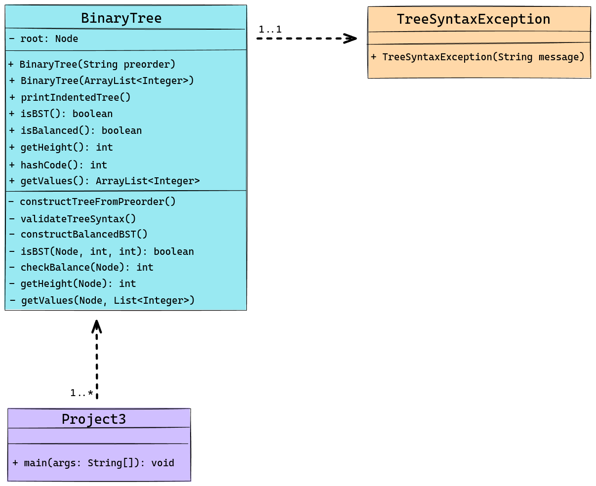

<!-- Title -->
<h1 align="center">Binary Tree Validation</h1>
<p align="center">

<i>The Binary Tree Validator is a Java application designed to validate and visualize binary trees based on their preorder string representations. It constructs the tree, checks if it is a balanced binary search tree, and outputs the tree in an indented form. The program also detects and reports syntax errors such as incomplete trees, non-integer data, missing parentheses, and extra characters. If the tree is not balanced, the application constructs and displays a balanced binary search tree with the same set of values. This project leverages robust parsing, validation techniques, and a clear textual representation to explore the properties of binary trees interactively.</i></p>

---

<h2 align="center">Tech Used 🧰</h2>

<!-- Tech Stack -->
<p align="center">
<kbd>
<a href="https://www.java.com/en/">
    
  </a> | <a href="https://makefiletutorial.com/">
    
  </a> | <a href="https://git-scm.com/">
    
  </a>
  
  </kbd>
</p>

## User Guide 📔

This guide provides instructions on how to set up and run the project using two different methods: Cloning the repository and downloading the project as a ZIP file.

### Prerequisites

Before you begin, ensure you have the following installed:

- Java JDK
- Git (for cloning the repository)

### File Structure

<details>
<summary><b>See File Tree</b></summary>

The suggested file structure for your project is as follows:

```
.
└── binary_tree_validator/
    ├── bin/
    │   ├── main class files
    │   └── test class files
    ├── public/
    │   └── image files
    ├── src/
    │   ├── main/
    │   │   ├── BinaryTree.java
    │   │   ├── Project3.java
    │   │   └── TreeSyntaxException.java
    │   └── tree/
    │       ├── BinaryTreeTest.java
    │       ├── Project3Test.java
    │       └── TreeSyntaxExceptionTest.java
    ├── Makefile
    └── README.md

```

</details>

### Option 1️⃣ : Cloning the Repository

1. **Clone the Repository**

   Open your terminal and run the following command to clone the repository: **`git clone git@github.com:sllozier/binary_tree_validator.git`**

2. **Navigate to the Project Directory**

    Once the repository is cloned, navigate to the project directory: **`cd path/to/binary_tree_validator`**

3. **Using the Makefile**

    - To generate text files, compile the project, run tests, and then run the project code (if tests pass), use: **`make all`**

    - To run tests (this will also generate text files), use:**`make run_tests`**

    - To run the project code (this will also generate text files), use:**`make run_project`**

    - To clean up and remove generated files, use: **`make clean`**

### Option 2️⃣ : Downloading the ZIP File

1. **Download the Project**

    Go to the repository page on GitHub (or relevant hosting service), and click on the **`Download ZIP`** button. Save the ZIP file to your desired location and extract it.

2. **Navigate to the Project Directory**

    Open your terminal and navigate to the extracted project directory: **`cd path/to/extracted/binary_tree_validator`**

3. **Using the Makefile**

    Follow the same steps as in **Option 1** for using the Makefile.

---

*Remember to replace **`[repository URL]`** and **`path/to/binary_tree_validator`** with the actual URL of your repository and the path to the **`binary_tree_validator`** directory in your local system. This guide assumes that the Makefile is located in the **`binary_tree_validator`** directory and is set up as previously discussed.*

---

## Approach

For Project 3, the objective was to develop a Java program that reads the preorder representation of a binary tree and determines whether it is a balanced binary search tree (BST). The approach involved parsing the input string to construct the tree structure, using parentheses and asterisks to denote the tree's hierarchy and null nodes, respectively. Two constructors were implemented in the `BinaryTree` class: one for creating a binary tree from a preorder string and another for constructing a balanced BST from an array list of integers. Syntax validation was handled by the `TreeSyntaxException` class, which threw exceptions for various syntax errors such as incomplete trees, non-integer data, and extra characters at the end. Various tree operations were implemented, including methods to check if the tree is a BST, determine if it is balanced, calculate its height, and print it in an indented form. If the input tree was not a balanced BST, a new balanced BST was constructed using the values from the original tree. The `Project3` class handled user interaction, allowing repeated input and output for tree analysis and rebalancing operations.

## Assumptions

Several assumptions were made for Project 3. It was assumed that the input string for the preorder representation of the tree was correctly formatted with parentheses and asterisks. The values in the tree were presumed to be integers, and it was assumed that the input string did not contain any extraneous spaces or invalid characters. Additionally, the program was expected to handle user inputs correctly and prompt for additional inputs until the user decided to stop.

## Lessons Learned

Project 3 provided valuable insights into tree construction and traversal. Building a binary tree from a preorder string and ensuring its correctness through syntax validation was a challenging yet rewarding process. Implementing methods to check if the tree is a BST and determine if it is balanced reinforced the importance of understanding tree properties and operations. Constructing a balanced BST from an array list of values highlighted the efficiency and practicality of balanced tree structures. Handling user input and providing clear output emphasized the importance of user interaction in software design. Overall, the project enhanced my understanding of binary trees, BSTs, and tree balancing techniques.

## Possible Improvements

Several improvements could be made to Project 3. Implementing a graphical user interface (GUI) for visualizing the binary tree would provide a more intuitive and engaging user experience. Adding the capability to rebalance the existing tree in place, rather than constructing a new balanced BST, could improve the efficiency and practicality of the program. Enhancing the error handling mechanisms to include more sophisticated error recovery techniques would make the program more robust and user-friendly. Additionally, optimizing the tree construction and validation algorithms could further improve the performance of the program.

---

### UML Diagram

<details>
<summary><b>See Diagram</b></summary>

</details>

---

<h2 align="center">Contact Me 🦄</h2>
<!-- Contact Me -->
<p align="center">
<kbd>
<a href="mailto:sarah.lozier@gmail.com">
    
  </a> | <a href="https://www.sllozier.com">
    
  </a> | <a href="https://www.linkedin.com/in/sarah-l-lozier/">
    
  </a> | <a href="https://github.com/sllozier/resume/raw/main/sarah_lozier_resume%20.pdf">
    
  </a>
  </kbd>
</p>
